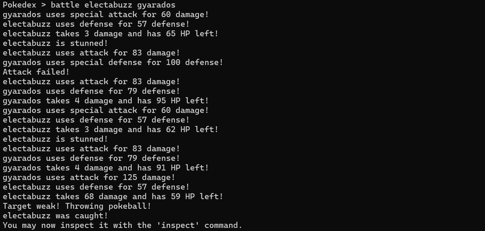
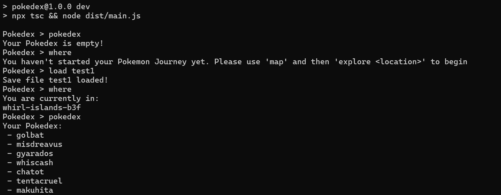

# Pokédex
Pokédex is a command-line Pokémon exploration game written in TypeScript. It uses the PokéAPI to allow players to explore locations, catch Pokémon, battle them, and save their progress. The project originated from a Boot.dev guided project and was subsequently expanded into a larger TypeScript application with additional gameplay systems, persistence, testing, architectural improvements, and new mechanics.

## Engineering Skills Demonstrated:
-	Designing stateful CLI applications in TypeScript. 
-	Working with asynchronous APIs. 
-	Implementing caching. 
-	Structuring larger TypeScript projects. 
-	Refactoring for maintainability. 
-	Designing and maintaining automated tests with Vitest.
-	Serialising and restoring application state with JSON.

## Tech Stack:
-	TypeScript 
-	Node.js 
-	REST API integration 
-	Async/await 
-	REPL application design 
-	JSON serialisation 
-	In-memory caching 
-	Vitest 
-	Application state management and persistence

## Quick start: 

### Clone the repository:
```bash
git clone https://github.com/ajrollerson/pokedex
cd pokedex
```

### Install dependencies:
```bash
npm install
```

### Run the application:
```bash
npm run dev
```

### Run the test suite:
```bash
npm run test
```

## Key features:

### Original project features:
-	REPL interface 
-	PokéAPI integration 
-	Basic caching 
-	Initial automated tests

### Extensions Beyond the Original Project:
-	JSON save/load persistence 
-	A turn-based autobattle system 
-	Player location tracking 
-	Additional validation and error handling 
-	Architectural refactoring using helper abstractions 
-	Expanded automated testing 
-	Improved application reliability through bug fixes

## Screenshots

### Autobattle system


### Save/load persistence across sessions


## Design choices:
-	Added save/load functionality so player progress persists across sessions.
-	The autobattle system was intentionally implemented as a prototype rather than a full recreation of Pokémon's battle mechanics. The focus was on designing reusable battle logic and demonstrating object interaction rather than reproducing every game mechanic.
-	Introduced a BattleStats abstraction to convert nested API responses into a simpler representation for battle calculations, reducing repeated traversal of Pokémon stat objects. 
-	Refactored repeated battle-round logic into helper functions to reduce duplication and improve maintainability as new mechanics were added. 
-	Extended the existing application state to support persistent player location and introduced a save abstraction as well as save/load functionality using JSON serialisation. 
-	Reused the existing caching system to avoid redundant API requests instead of introducing duplicate network calls.
-	Added a where command to expose the player's current location while ensuring location data can be cached and reused by future gameplay systems.
-	Expanded the automated test suite to improve confidence in core application behaviour.

## Known limitations:
-	The autobattle system currently uses core Pokémon statistics rather than modelling elemental types, individual moves, abilities, or status effects.
-	The game world is generated directly from the PokéAPI, so captured Pokémon remain available to encounter again. 
-	Game progression is designed for demonstration purposes rather than balance.

## Future improvements:
-	Implement a persistent Pokémon population system so that captured Pokémon are removed from the game world, making exploration and resource management more meaningful. 
-	Expand the battle system to incorporate Pokémon types, moves, abilities, and richer player interaction.
